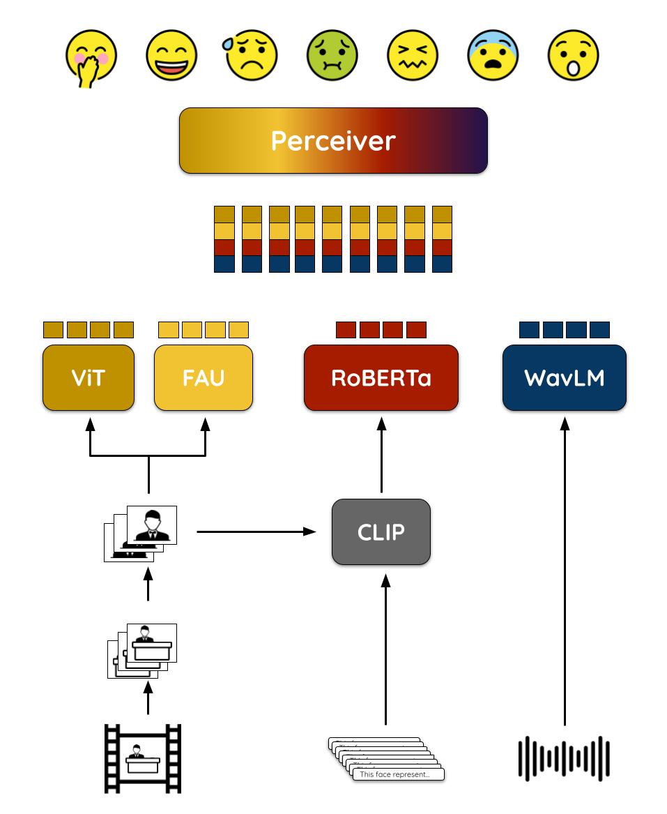

# ViPER: Video-based Perceiver for Emotion Recognition

This repository contains the code for the paper "ViPER: Video-based Perceiver for Emotion Recognition" submitted for the [MuSe 2022](https://www.muse-challenge.org/muse2022) Reaction Sub-Challenge.

Recognizing human emotions from videos requires a deep understanding of the underlying multimodal sources, including images, audio, and text. Since the input data sources are highly variable across different modality combinations, leveraging multiple modalities often requires ad hoc fusion networks. To predict the emotional arousal of a person reacting to a given video clip we present ViPER, a multimodal architecture leveraging a modality-agnostic transformer-based model to combine video frames, audio recordings, and textual annotations. Specifically, it relies on a modalityagnostic late fusion network which makes ViPER easily adaptable to different modalities. The experiments carried out on the HumeReaction datasets of the MuSe-Reaction challenge confirm the effectiveness of the proposed approach.



## Pretraining

Extract frames from videos:

```
$ python get_frame.py \
  --input_folder data/mp4 \
  --output_folder data/frames \
  --n_frames 32 \
  --n_workers 16
```

Image cropping to detect people faces:

```
$ python crop_images.py \
  --input_folder data/frames \
  --output_folder data/frames_cropped \
  --batch_size 16 
```

Extract visual features from frames:

```
$ python extract_visual_features.py \
  --input_folder data/frames \
  --output_folder data/features/visual \
  --model_name vit-base \
  --batch_size 16 \
  --no-incremental
```

Extract audio features from raw audio files:

```
$ python extract_audio_features.py \
  --input_folder data/wav \
  --output_folder data/features/audio \
  --n_fragments 32 \
  --batch_size 32 \
  --no-incremental
```

Extract textual features from frames:

```
$ python extract_textual_features.py \
  --input_folder data/frames \
  --output_folder data/features/textual \
  --clip_checkpoint_path data/clip_model/model.pt \
  --batch_size 32 \
  --no-incremental
```

## Training

Training Perceiver:

```
$ python train_perceiver.py \
  --visual \
  --audio \
  --textual \
  --FAU \
  --visual_features_input_folder data/features/visual_cropped_age \
  --audio_features_input_folder data/features/audio \
  --textual_features_input_folder data/features/textual_cropped \
  --FAU_features_input_folder data/features/FAU \
  --csv_path data/data_info.csv \
  --output_checkpoint_folder data/checkpoints \
  --output_log_file data/log.txt \
  --n_epochs 50 \
  --batch_size 16 \
  --learning_rate 1e-5 \
  --step_size 10 \
  --log_steps 10
```

## Evaluation

Test Predictions:

```
$ python submission_creation.py \
  --visual \
  --audio \
  --textual \
  --FAU \
  --visual_features_input_folder data/features/visual_cropped_age \
  --audio_features_input_folder data/features/audio \
  --textual_features_input_folder data/features/textual_cropped \
  --FAU_features_input_folder data/features/FAU \
  --csv_path data/data_info.csv \
  --output_path data/submissions/submission.csv \
  --model_path data/checkpoints/checkpoints_VATF_cropped_age/perceiver_7.model \
  --batch_size 32
```

Confusion matrix:

```
$ python confusion_matrix.py \
  --visual \
  --audio \
  --textual \
  --FAU \
  --visual_features_input_folder data/features/visual_cropped_age \
  --audio_features_input_folder data/features/audio \
  --textual_features_input_folder data/features/textual_cropped \
  --FAU_features_input_folder data/features/FAU \
  --csv_path data/data_info.csv \
  --model_path data/checkpoints/checkpoints_VATF_cropped_age/perceiver_7.model \
  --batch_size 32
```

## Citation
```
@inproceedings{10.1145/3551876.3554806,
  author = {Vaiani, Lorenzo and La Quatra, Moreno and Cagliero, Luca and Garza, Paolo},
  title = {ViPER: Video-Based Perceiver for Emotion Recognition},
  year = {2022},
  isbn = {9781450394840},
  publisher = {Association for Computing Machinery},
  address = {New York, NY, USA},
  url = {https://doi.org/10.1145/3551876.3554806},
  doi = {10.1145/3551876.3554806},
  booktitle = {Proceedings of the 3rd International on Multimodal Sentiment Analysis Workshop and Challenge},
  pages = {67–73},
  numpages = {7},
  keywords = {emotion recognition, modality-agnostic learning, multimodal learning, video processing},
  location = {Lisboa, Portugal},
  series = {MuSe' 22}
}
```


